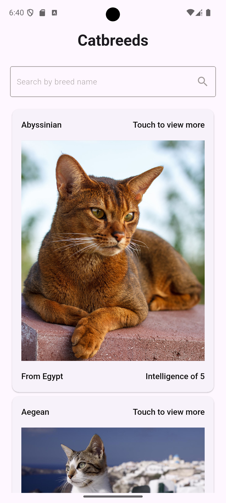
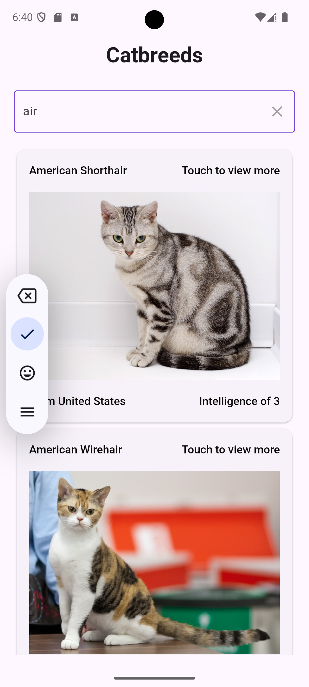
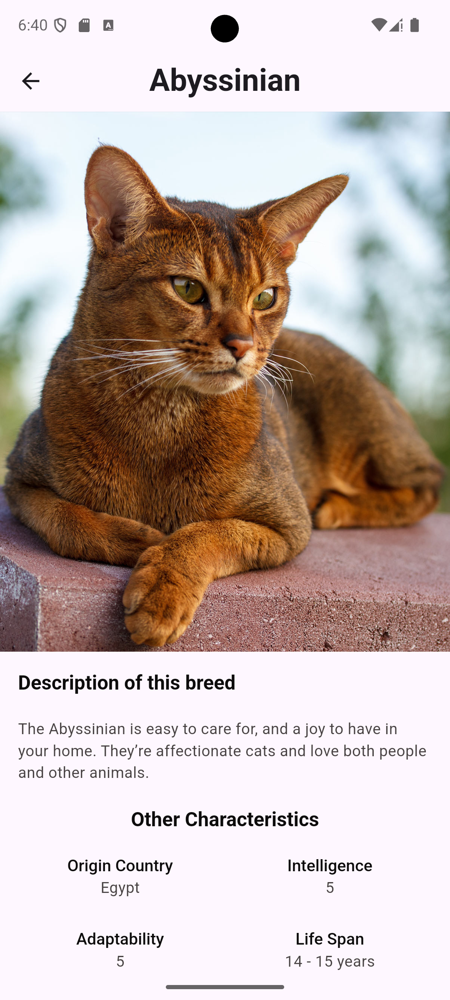

# 🐾 Pragma_test

Una aplicación Flutter que muestra información detallada sobre distintas razas de gatos utilizando [TheCatAPI](https://thecatapi.com/).
Fue desarrollada como prueba técnica para Pragma.

## 📱 Capturas de pantalla

<p float="left">
  
  
  
</p>

## 🚀 Características

- Listado de razas de gatos con imágenes.
- Detalle completo de cada raza (temperamento, origen, vida útil, etc).
- Integración con API REST.
- Pruebas unitarias con mocks.
- Gestión segura de claves con variables de entorno.
- Diseño adaptable y responsivo.

## 🧑‍💻 Tecnologías

- Flutter 3.29.2 
- Dart 3.7.2
- [flutter_dotenv](https://pub.dev/packages/flutter_dotenv) (variables de entorno)
- [http](https://pub.dev/packages/http) (consumo de api REST)
- [get_it](https://pub.dev/packages/get_it) (inyección de dependencias)
- [flutter_bloc](https://pub.dev/packages/flutter_bloc) (gestor de estados)

## 🔐 Configuración de variables de entorno

Crea un archivo `.env` en la raíz del proyecto con tu clave de API:

```env
API_KEY=tu_api_key_aqui
BASE_URL=url_base_aquí
```

## 🛠️ Como ejecutar el proyecto

### 1. Clona el repositorio
   
git clone https://github.com/johangv/pragma_test.git
cd flutter-cat-app

### 2. Instala dependencias
flutter pub get

### 3. Crea tu archivo .env en la raiz del proyecto con tu clave de API y url base

# 4. Ejecuta la app
flutter run

